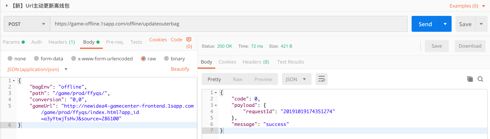
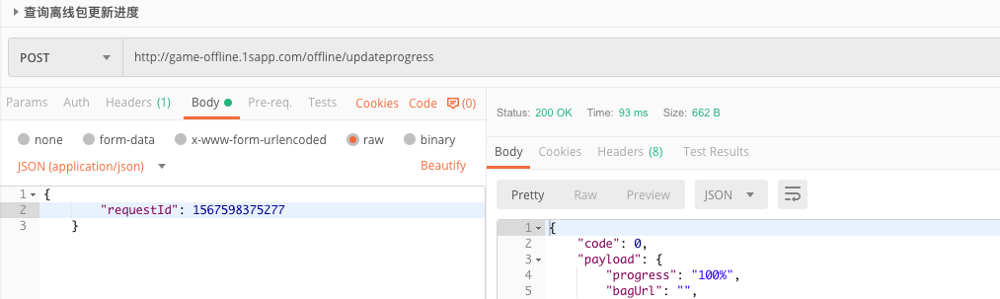
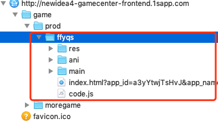
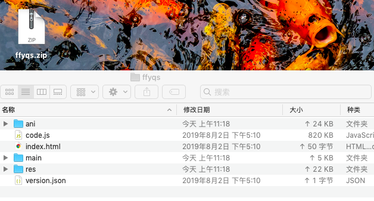

# 趣头条游戏中心离线包

为了提升游戏加载速度，趣头条App会提前把**首屏游戏资源**打包到客户端，在访问游戏资源的时候直接走客户端本地。

在第一次接入离线包的时候游戏方需要提供：

1. 游戏名称（必须）：和游戏中心显示的一致。
2. 游戏链接（必须）：可以完整进入游戏。
3. 资源路径（必须）：游戏访问资源相对于域名所在的路径，游戏中心只会抓取这个路径下的资源，路径外的资源不会管。
    
**案例：**

    1. 游戏名称：发发摇钱树
    2. 游戏链接：http://newidea4-gamecenter-frontend.1sapp.com/game/prod/ffyqs/index.html?app_id=a3yYtwjTsHvJ&source=286100
    3. 资源路径：/game/prod/ffyqs/

我方(微信:MazeyQian)会根据这些信息给游戏方生成一个 `offlineId`，并且此时游戏已经拥有访问的功能，在切换底导和重启App的时候会自动检测离线包资源是否更新并下载资源。

后续游戏资源更新的时候[不推荐]可依照[接口文档](#接口文档)主动更新离线包，[推荐]也可以将资源路径下的资源打包（ZIP）给游戏中心，让游戏中心手动更新离线包。

### 接口文档

#### 1.主动更新离线包

请求方式：`POST`

HOST：`game-offline.1sapp.com`

请求URI: `/offline/updateouterbag`

| 参数 | 是否必须 | 类型 | 描述 |
| --- | --- | --- | --- |
| bagEnv | 是 | string | 生产为:offline，测试为:offline/test， |
| path | 是 | string | 资源路径 |
| conversion | 是 | string | 游戏开始按钮的坐标，eg: "0,0" |
| gameUrl | 是 | string | 游戏可访问url |

返回

| 参数 | 是否必须 | 类型 | 描述 |
| --- | --- | --- | --- |
| code | 是 | number | 接口返回code值 |
| payload | 是 | json | 返回的主体内容，requestId：查询更新进度所需参数 |
| message | 是 | string | 错误信息 |

**示例：**

请求

```http request
POST /offline/updateouterbag? HTTP/1.1
Host: game-offline.1sapp.com
Content-Type: application/json
cache-control: no-cache
{
    "bagEnv": "offline",
    "path": "/game/prod/ffyqs/",
    "conversion": "0,0",
    "gameUrl": "http://newidea4-gamecenter-frontend.1sapp.com/game/prod/ffyqs/index.html?app_id=a3yYtwjTsHvJ&source=286100"
}
```

返回

```json
{
    "code": 0,
    "payload": {
        "requestId": "20191019174351274"
    },
    "message": "success"
}
```

主动更新 Postman 参考：



#### 2.更新离线包进度查询

请求方式：`POST`

HOST：`game-offline.1sapp.com`

请求URI: `/offline/updateprogress`

| 参数 | 是否必须 | 类型 | 描述 |
| --- | --- | --- | --- |
| requestId | 是 | string | 更新离线包的请求ID |

返回

| 参数 | 是否必须 | 类型 | 描述 |
| --- | --- | --- | --- |
| code | 是 | number | 接口返回code值 |
| payload | 是 | json | 返回的主体内容 |
| message | 是 | string | 错误信息 |


**示例：**

请求

```http request
POST /offline/updateprogress HTTP/1.1
Host: game-offline.1sapp.com
Content-Type: application/json
cache-control: no-cache
{   
    "requestId": "20191019174351274"
}
```

返回

```json
{
    "code": 0,
    "payload": {
        "progress": "100%",
        "bagUrl": "http://game-cdn.1sapp.com/offline/release/20191019174351274.zip",
        "description": "....",
        "gameUrl": "https://cdn.heidong.midsummer.top/release/20191015213749/index.html?app_id=a3E67uTiPJw5&app_name=%E7%8C%9C%E6%88%90%E8%AF%AD%E6%8B%BF%E9%87%91%E5%B8%81&appid=a3E67uTiPJw5&dc=868237046772793&ext=eyJzb3VyY2UiOiIyODYxNjYifQ%3D%3D&origin_type=0&platform=qtt&sign=2e2cc6cadaf7c7d5ccfd1b435330f4c6&source=286166&ticket=t11XUatVTysECAfYUwrab&time=1571477991&uuid=2544805&v=30946000&vn=3.9.46.000.1009.2251&dtu=014&lat=0.0&lon=0.0&screen_location=2"
    },
    "message": "success"
}
```

进度查询 Postman 参考：



## Q&A

### Q: 资源路径是什么?

A: 以发发摇钱树为例。



提供的路径是 */game/prod/ffyqs/*，则只会离线 */ffyqs/* 下面的 */res/* */ani/* 等资源，而 */moregame/* 路径下面的资源不离线。

### Q: 提供打包资源的时候，打包的是什么?

A：以发发摇钱树为例。

路径是 */game/prod/ffyqs/*，则提供的是 */ffyqs/* 下面的打包资源。



### Q：离线包会有什么限制？

A：目前建议大小限制在 30M 之内。

### Q：打包资源有什么建议？

A：离线包更频率越小越好，建议只打包不常更新的静态资源，迭代比较快的资源建议剔除掉（例如：index.html，业务 JS 文件）。
